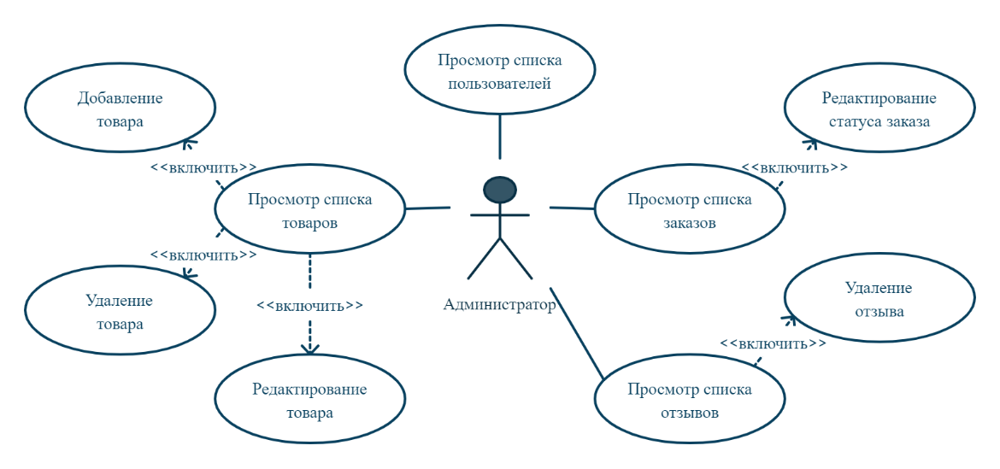
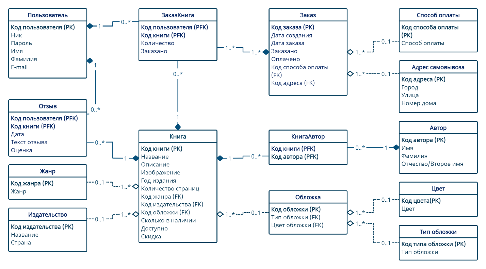

Создание веб-приложения по продаже книг. Для создания веб-приложения использовался язык программирования Python и фреймворк Django. В качестве базы данных был выбран MySQL.

Были выделены три роли: администратор, авторизованный и неавторизованный пользователь. К каждой роли были предъявлены функциональные требования, представленные на изображениях ниже:

Логическая модель базы данных выглядит следующим образом:

